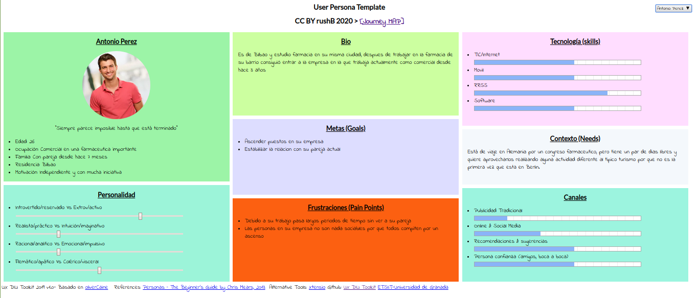
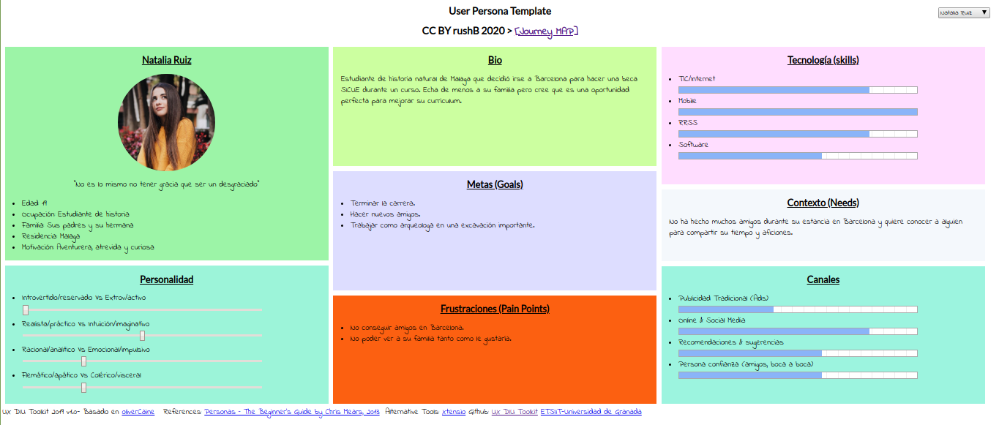

## Paso 1. UX Desk Research & Analisis 

 1.a Competitive Analysis
-----

>>> La aplicación seleccionada es meetup, se utiliza para ofertar y apuntarse a actividades de ocio donde conocer gente y hacer cosas nuevas.
Lo que me ha llevado a elegir esta página es la cantidad de recomendaciones que realiza basadas en tus gustos o localización y el gran número de categorías que tiene para buscar algo que te resulte interesante. Para cada evento te muestra una pequeña descripción, otros eventos parecidos, los miembros ya apuntados, los organizadores, algunas fotos y conversaciones al respecto. Otra característica importante es la posibilidad de crear tus propios grupos para que la gente se una a tus planes.

 1.b Persona
-----

>>> Son dos personas jóvenes pero sus propósitos son muy diferentes, Antonio busca algo esporádico para un solo día mientras que Natalia quiere algo duradero para consolidar un grupo de amigos que compartan sus aficiones.

 1.c User Journey Map
----

>>> Son dos experiencias que podrían ser muy comunes pero tienen motivaciones diferentes. Lo llamativo es que cada uno llega a la página con una recomendación totalmente diferente y consigue su propósito. 

 1.d Usability Review
----
>>> - Enlace al documento:  https://github.com/juanzip/DIU20/blob/master/Usability-review-template-final.pdf 
>>> - Valoración final (numérica): 78
>>> - Comentario sobre la valoración: En general la aplicación cumple su función sobradamente y no tiene ningún problema grave destacable quitando que cuando no tienes cuenta no hay un buscador disponible. 
