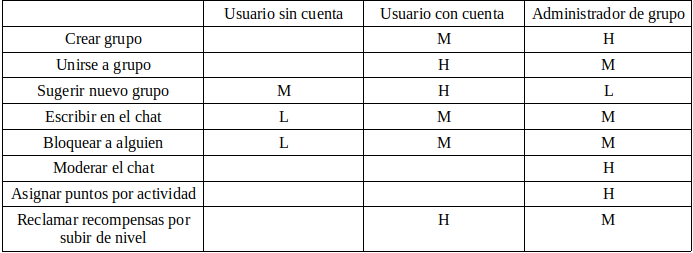
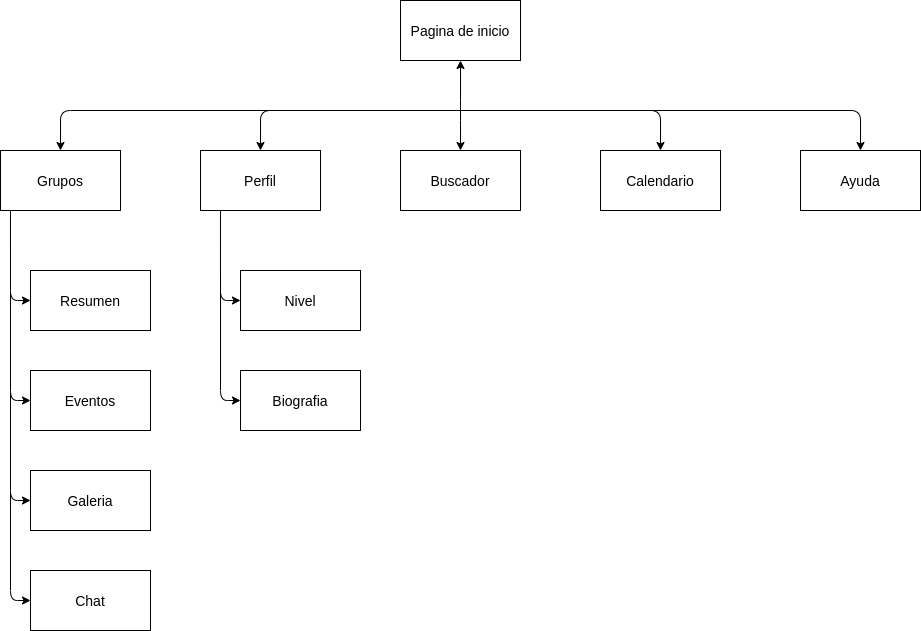
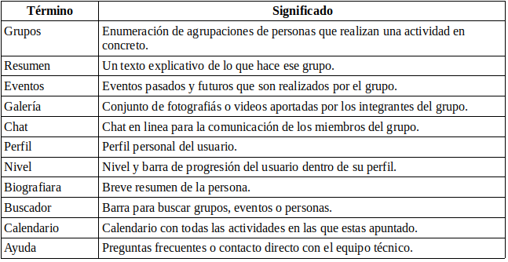
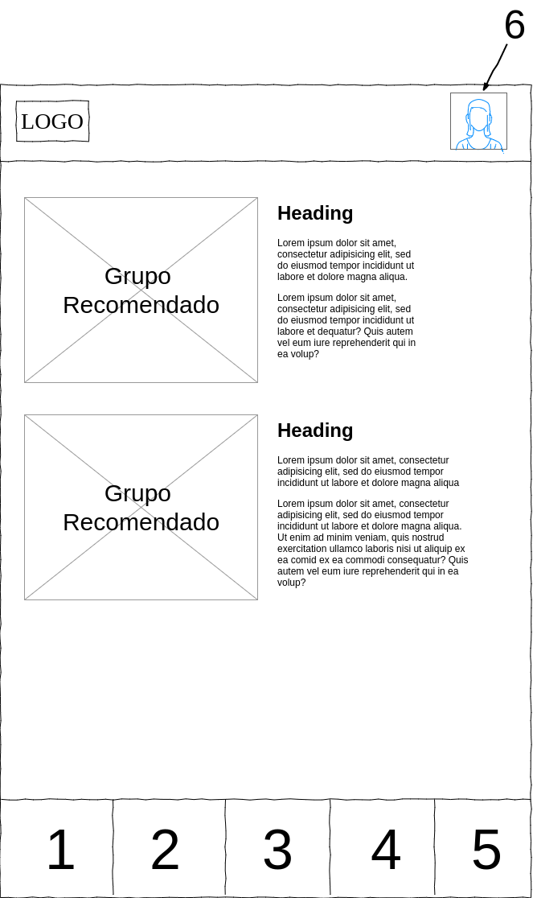
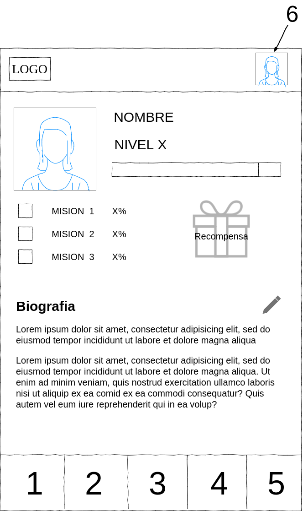
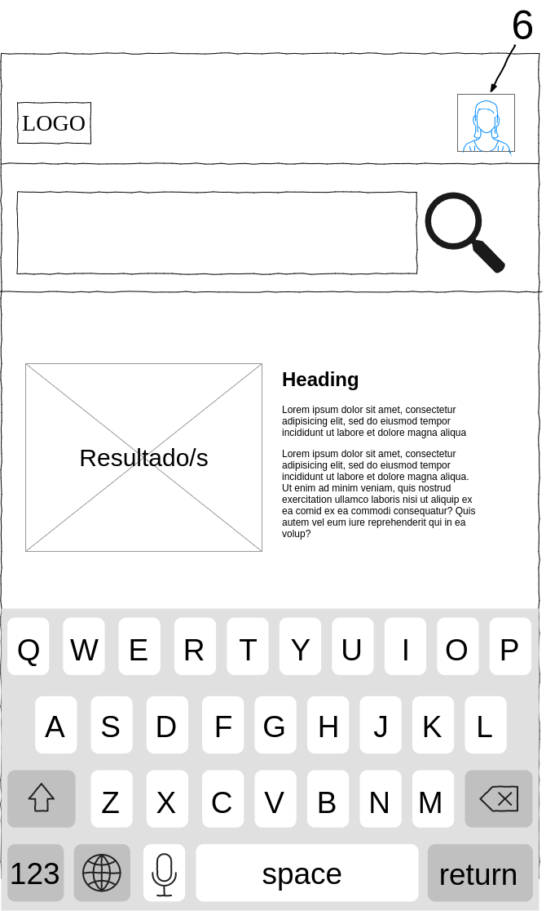
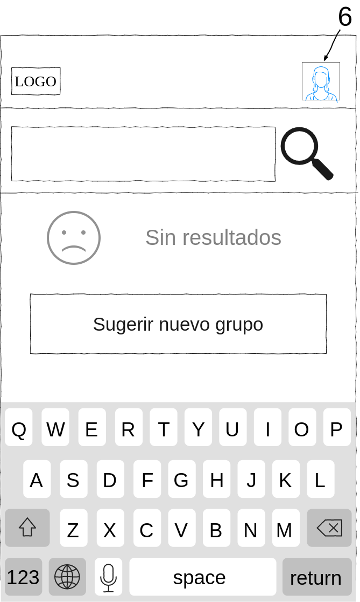

## Paso 2. UX Design  

 2.a Feedback Capture Grid
----

  
  
  
>>>La propuesta de valor que he pensado es para fidelizar a los usuarios de la aplicación con un sistema de niveles y recompensas según las actividades que realicen, como apuntarse a actividades o ser administradores de un grupo.

 2.b Tasks & Sitemap 
-----
>>> Matriz de Tareas/Usuarios

>>> Sitemap

 2.c Labelling 
----

 2.d Wireframes
-----

>>>Leyenda de los numeros en los bocetos:
>>>-1: Grupos  
>>>-2: Buscador  
>>>-3: Menu Principal  
>>>-4: Calendario  
>>>-5: Ayuda  
>>>-6: Perfil  

>>> Boceto de la pagina princial

>>> Boceto del perfil de usuario

>>> Boceto del calendario

>>> Boceto de la pagina de uno de los grupos

>>> Boceto del buscador

>>> Boceto del buscador cuando no encuentra resultados

>>>La opción de grupos te lleva a una lista de todos los grupos a los que perteneces, en este caso he realizado el boceto de un grupo concreto puesto que pienso que aporta más.

>>>En el buscador se puede dar el caso de no encontrar el grupo que se desea y en ese caso te da la opción de sugerir la creación de ese grupo. Lo propones pero no lo creas tú.
