# DIU20
Prácticas Diseño Interfaces de Usuario 2019-20 (Economía Colaborativa) 

Grupo: DIU3_rushB.  Curso: 2019/20 

Proyecto: 

Descripción: 

Logotipo: 

Miembros
 * :bust_in_silhouette:   Juan Nepomuceno Lucena López     :octocat:     

----- 

En esta práctica estudiaremos un caso de plataforma de economía colaborativa y realizaremos una propuesta para su diseño Web/movil. Utilizaremos herramientas y entregables descritos en el siguiente CheckList (https://github.com/mgea/UX-DIU-Checklist) 

Qué es economia colaborativa: Martínez-Polo, J. (2019). **El fenómeno del consumo colaborativo: del intercambio de bienes y servicios a la economía de las plataformas**, *Sphera Publica, 1*(19), 24-46. http://sphera.ucam.edu/index.php/sphera-01/article/view/363/14141434

>>> Este documento es el esqueleto del report final de la práctica. Aparte de subir cada entrega a PRADO, se debe actualizar y dar formato de informe final a este documento online. 

# Propuesta de aplicación para compartir ocio 

La idea es crear una aplicación que permita a las personas ponerse en contacto para realizar planes de ocio o cultura de forma conjunta, creando grupos con jerarquia y la posibilidad de compartirlo todo en todo momento.

## Paso 1. UX Desk Research & Analisis 

 1.a Competitive Analysis
-----

>>> La aplicación seleccionada es meetup, se utiliza para ofertar y apuntarse a actividades de ocio donde conocer gente y hacer cosas nuevas.
Lo que me ha llevado a elegir esta página es la cantidad de recomendaciones que realiza basadas en tus gustos o localización y el gran número de categorías que tiene para buscar algo que te resulte interesante. Para cada evento te muestra una pequeña descripción, otros eventos parecidos, los miembros ya apuntados, los organizadores, algunas fotos y conversaciones al respecto. Otra característica importante es la posibilidad de crear tus propios grupos para que la gente se una a tus planes.

 1.b Persona
-----

>>> Son dos personas jóvenes pero sus propósitos son muy diferentes, Antonio busca algo esporádico para un solo día mientras que Natalia quiere algo duradero para consolidar un grupo de amigos que compartan sus aficiones.
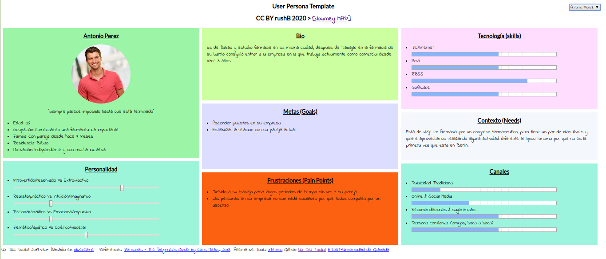
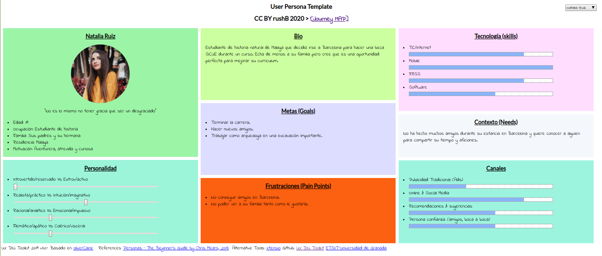

 1.c User Journey Map
----

>>> Son dos experiencias que podrían ser muy comunes pero tienen motivaciones diferentes. Lo llamativo es que cada uno llega a la página con una recomendación totalmente diferente y consigue su propósito. 
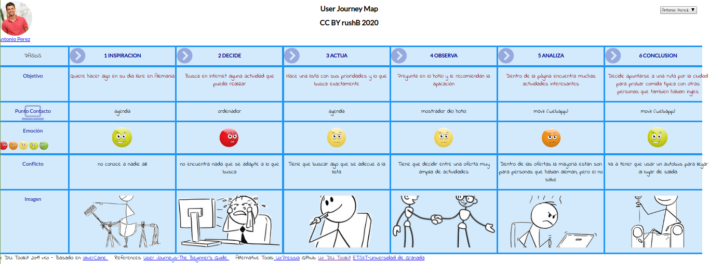
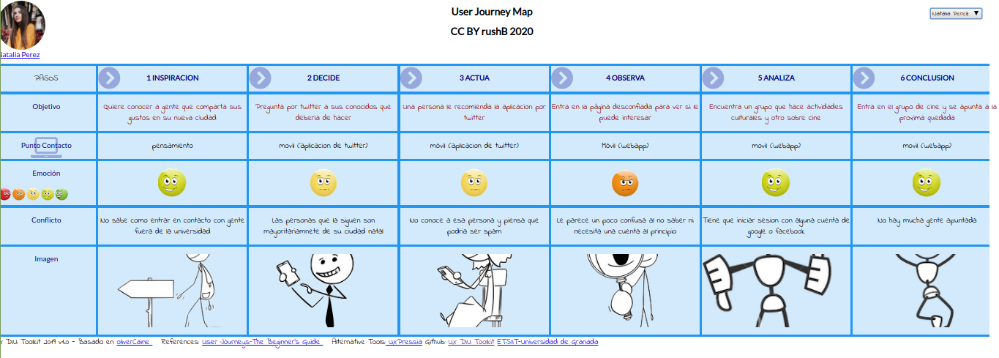

 1.d Usability Review
----
>>> - Enlace al documento:  https://github.com/juanzip/DIU20/blob/master/Usability-review-template-final.pdf 
>>> - Valoración final (numérica): 78
>>> - Comentario sobre la valoración: En general la aplicación cumple su función sobradamente y no tiene ningún problema grave destacable quitando que cuando no tienes cuenta no hay un buscador disponible. 

## Paso 2. UX Design  

 2.a Feedback Capture Grid
----

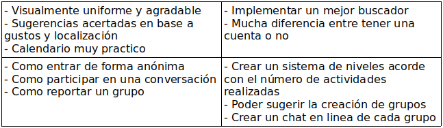

  
  
  
>>>La propuesta de valor que he pensado es para fidelizar a los usuarios de la aplicación con un sistema de niveles y recompensas según las actividades que realicen, como apuntarse a actividades o ser administradores de un grupo.

 2.b Tasks & Sitemap 
-----
>>> Matriz de Tareas/Usuarios
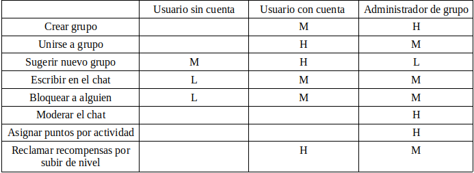

>>> Sitemap
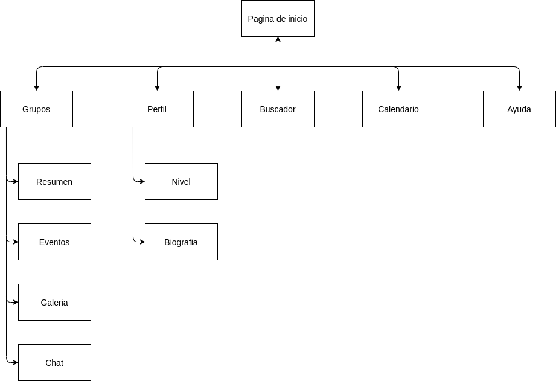

 2.c Labelling 
----

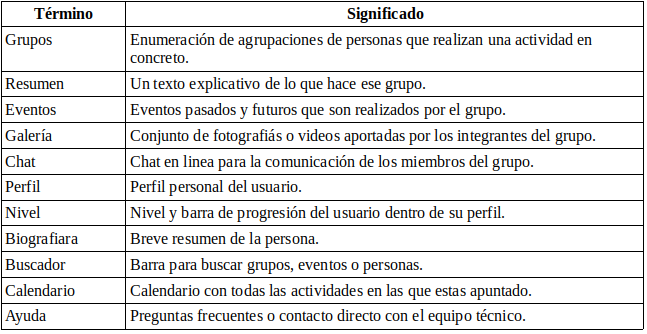

 2.d Wireframes
-----

>>>Leyenda de los numeros en los bocetos:
>>>-1: Grupos  
>>>-2: Buscador  
>>>-3: Menu Principal  
>>>-4: Calendario  
>>>-5: Ayuda  
>>>-6: Perfil  

>>> Boceto de la pagina princial
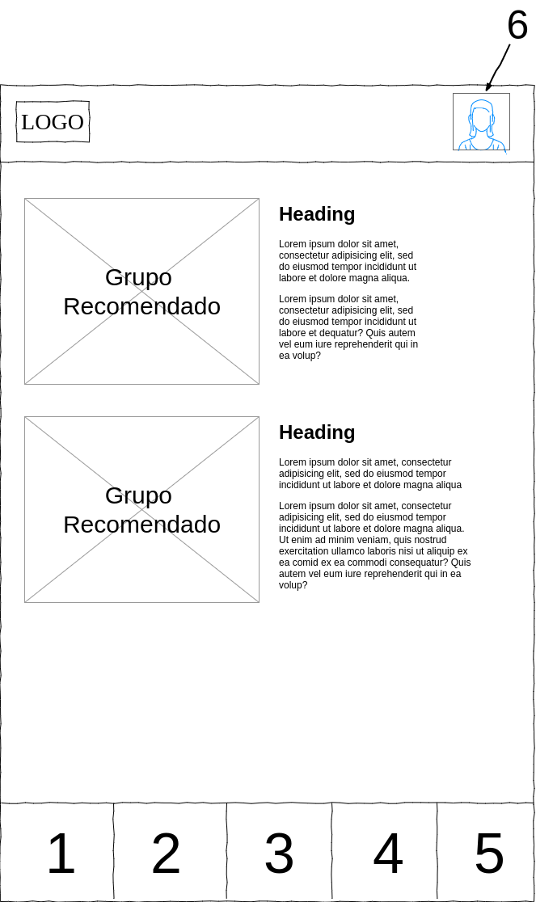

>>> Boceto del perfil de usuario
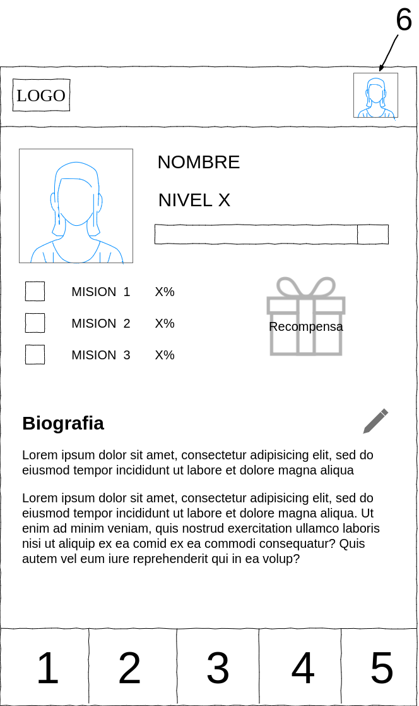

>>> Boceto del calendario
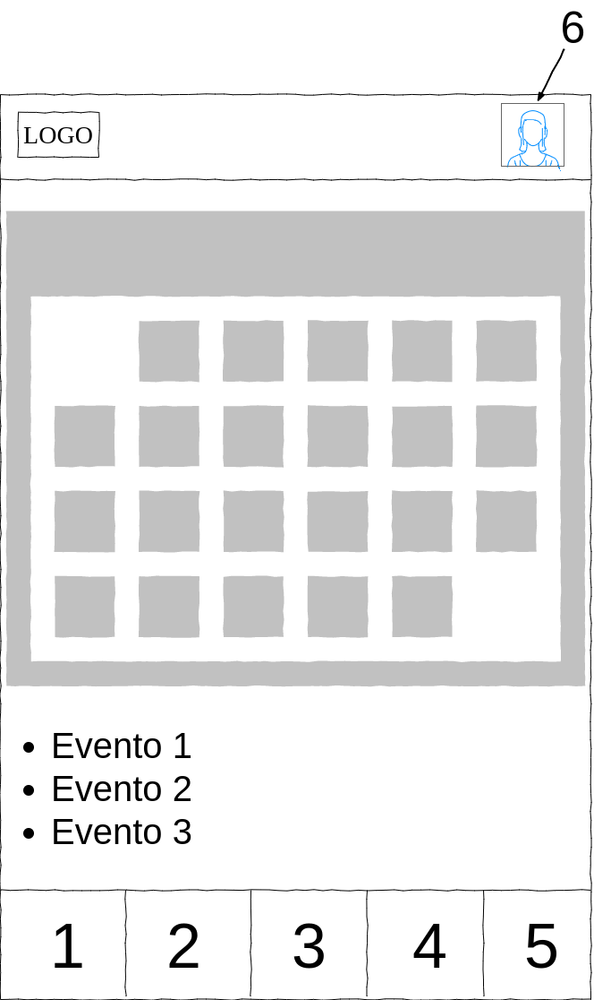

>>> Boceto de la pagina de uno de los grupos
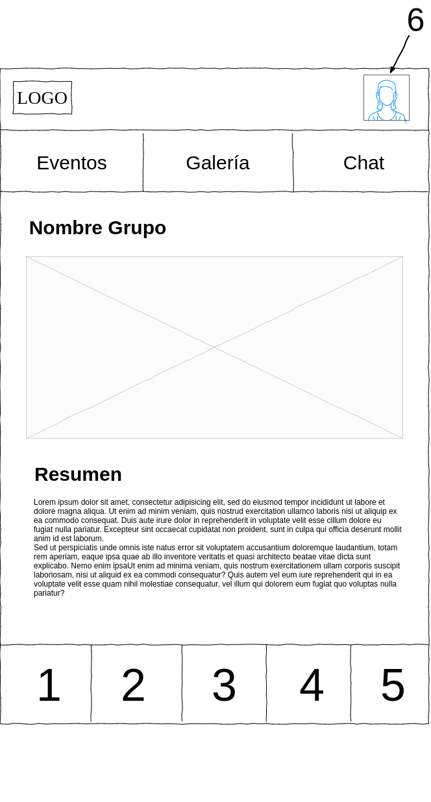

>>> Boceto del buscador
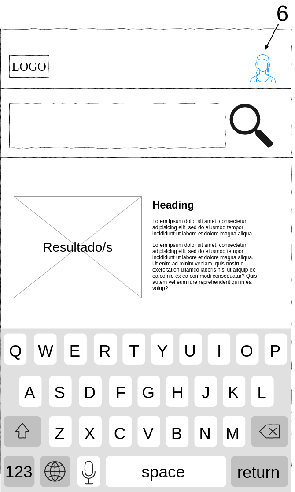

>>> Boceto del buscador cuando no encuentra resultados
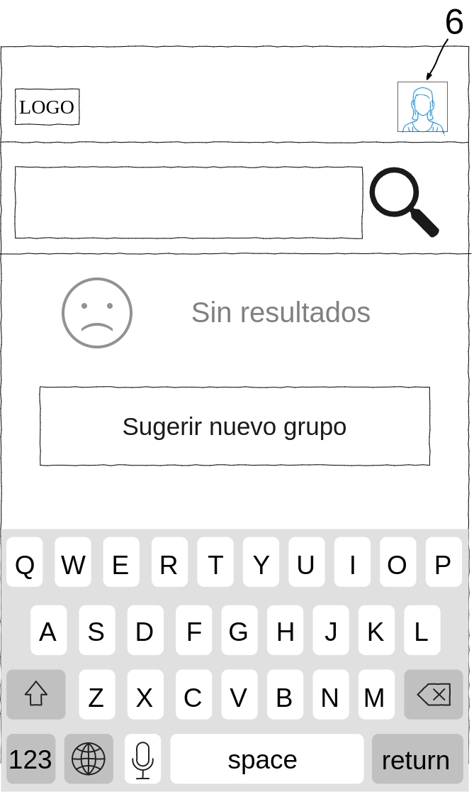

>>>La opción de grupos te lleva a una lista de todos los grupos a los que perteneces, en este caso he realizado el boceto de un grupo concreto puesto que pienso que aporta más.

>>>En el buscador se puede dar el caso de no encontrar el grupo que se desea y en ese caso te da la opción de sugerir la creación de ese grupo. Lo propones pero no lo creas tú.

## Paso 3. Make (Prototyping) 

 3.a Moodboard
-----

>>> Plantear Diseño visual con una guía de estilos visual (moodboard) 

  3.b Landing Page
----

>>> Plantear Landing Page 

 3.c Guidelines
----

>>> Estudio de Guidelines y Patrones IU a usar 

  3.d Mockup
----

>>> Layout: Mockup / prototipo HTML  (que permita simular tareas con estilo de IU seleccionado)

## Paso 4. UX Check (Usability Testing) 

 4.a A/B Testing
----

>>> Comprobacion de asignaciones para A/B Testing. Asignaciones https://github.com/mgea/DIU19/blob/master/ABtesting.md

>>>> Práctica A: 

 4.b User Testing
----

>>> Usuarios para evaluar prácticas 

| Usuarios | Sexo/Edad     | Ocupación   |  Exp.TIC    | Personalidad | Plataforma | TestA/B
| ------------- | -------- | ----------- | ----------- | -----------  | ---------- | ----
| User1's name  | H / 18   | Estudiante  | Media       | Introvertido | Web.       | A 
| User2's name  | H / 18   | Estudiante  | Media       | Timido       | Web        | A 
| User3's name  | M / 35   | Abogado     | Baja        | Emocional    | móvil      | B 
| User4's name  | H / 18   | Estudiante  | Media       | Racional     | Web        | B 

. 4.c Cuestionario SUS
----

>>> Usaremos el **Cuestionario SUS** para valorar la satisfacción de cada usuario con el diseño (A/B) realizado. Para ello usamos la [hoja de cálculo](https://github.com/mgea/DIU19/blob/master/Cuestionario%20SUS%20DIU.xlsx) para calcular resultados sigiendo las pautas para usar la escala SUS e interpretar los resultados
http://usabilitygeek.com/how-to-use-the-system-usability-scale-sus-to-evaluate-the-usability-of-your-website/)
Para más información, consultar aquí sobre la [metodología SUS](https://cui.unige.ch/isi/icle-wiki/_media/ipm:test-suschapt.pdf)

>>> Adjuntar captura de imagen con los resultados + Valoración personal 

 4.c Usability Report
----

>> Añadir report de usabilidad para práctica B 

## Paso 5. Evaluación de Accesibilidad  

  5.a Accesibility evaluation Report
----

>>> Indica qué pretendes evaluar (de accesibilidad) y qué resultados has obtenido + Valoración personal

>>> Evaluación de la Accesibilidad (con simuladores o verificación de WACG) 

## Conclusión / Valoración de las prácticas

>>> (90-150 caracteres) Opinión del proceso de desarrollo de diseño siguiendo metodología UX y valoración (positiva /negativa) de los resultados obtenidos  

